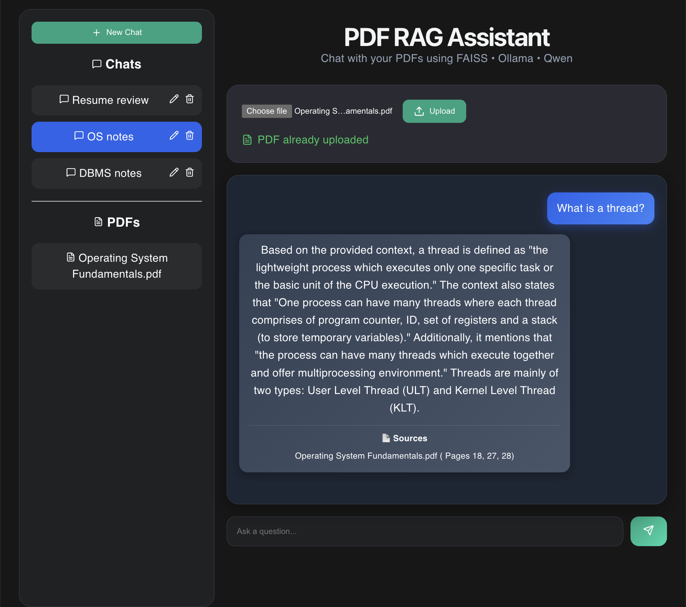
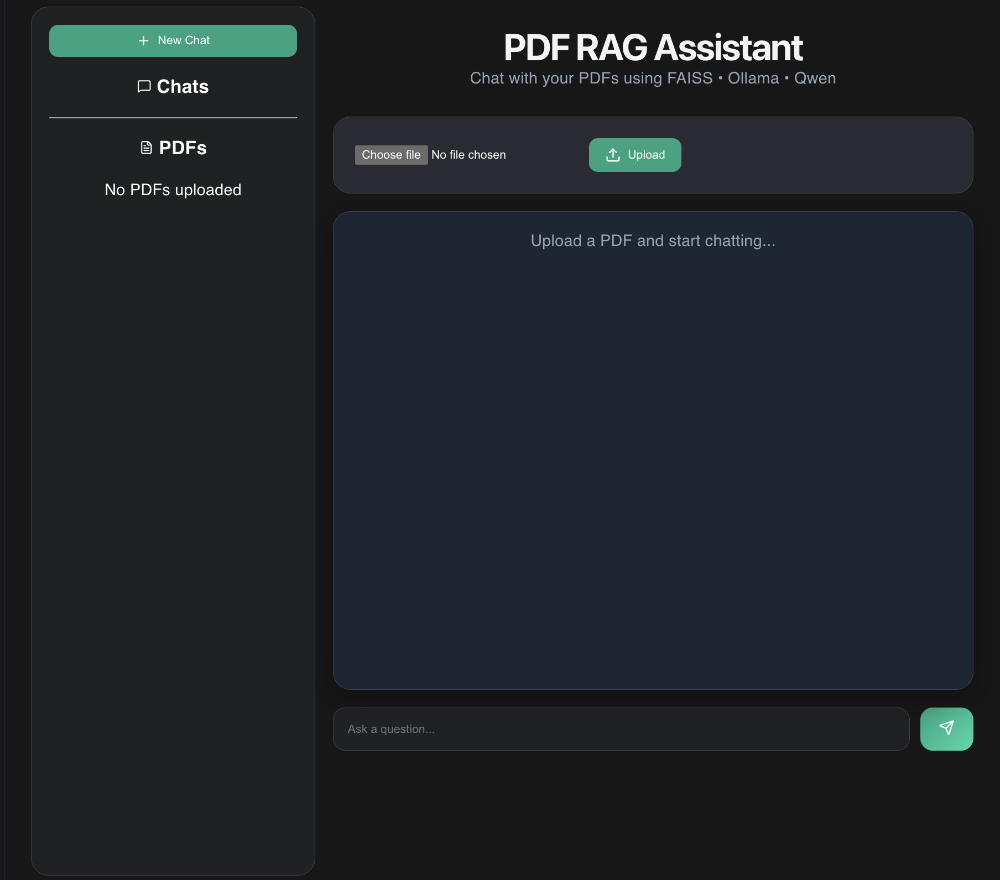

# PDF RAG Assistant

A multi-workspace Retrieval-Augmented Generation (RAG) application built with React, FastAPI, FAISS, Ollama, and Qwen. The application allows users to create independent chat workspaces, upload PDFs to specific chats, and ask questions grounded in uploaded documents.

## Screenshots

### Multi-Workspace Chat Management and PDF Question Answering



### UI



## Features

### Multi-Workspace Chats

- Create multiple chat workspaces
- Independent PDF collections per workspace
- Chat-specific retrieval and memory
- Rename and delete chats
- Automatic AI-generated chat titles

### PDF Processing

- Upload PDFs to individual workspaces
- Automatic text extraction using PyPDF
- Paragraph-based document chunking
- Semantic embeddings using Nomic Embed Text

### Retrieval-Augmented Generation

- Vector similarity search using FAISS
- Context-aware retrieval
- Source citations with PDF and page references
- Local inference using Qwen 3 via Ollama

### Persistence

- Chat history persistence
- Chat title persistence
- PDF persistence
- Automatic FAISS index rebuilding on startup

### User Interface

- React frontend
- Dark mode UI
- Chat sidebar navigation
- Workspace management
- PDF explorer panel

## Architecture

```text
PDF Upload
    ↓
Text Extraction
    ↓
Chunking
    ↓
Embeddings (Nomic Embed Text)
    ↓
FAISS Vector Search
    ↓
Context Retrieval
    ↓
Qwen 3 (Ollama)
    ↓
Answer Generation
```

## Tech Stack

### Frontend

- React
- JavaScript
- CSS
- Lucide React

### Backend

- FastAPI
- Python
- Ollama
- Qwen 3
- Nomic Embed Text
- FAISS
- NumPy
- PyPDF

## Project Structure

```text
pdf-rag-assistant/
│
├── assets/
│   ├── chat-ui.png
│   └── multi-workspace.png
│
├── backend/
│   ├── main.py
│   ├── rag.py
│   ├── persistence.py
│   └── requirements.txt
│
├── frontend/
│   ├── src/
│   ├── components/
│   └── App.jsx
│
├── README.md
└── .gitignore
```

## Key Capabilities

- Workspace isolation
- Semantic search
- Document-grounded responses
- Persistent chat history
- Persistent PDF storage
- Source attribution
- Multi-chat management

## Future Improvements

- Cloud deployment
- Streaming responses
- PDF deletion
- Authentication
- Shared workspaces

## Status

**Current Version:** Multi-Workspace PDF RAG Assistant v1.0

### Completed

- Multi-chat architecture
- PDF workspace isolation
- Retrieval-Augmented Generation (RAG)
- FAISS vector search
- Source citations
- Chat persistence
- PDF persistence
- Automatic title generation
- React frontend
- FastAPI backend

### Next Milestone

- Production deployment
- VPS hosting with Ollama
- HTTPS and custom domain